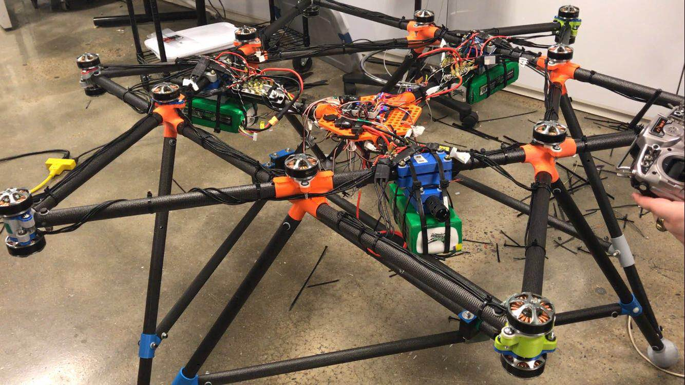

# Drone-Autonomous-Flight

* Designed autonomous flight program in Python for a big drone with diameter of 1 meter. Coded the done to fly to target positions with GPS. The drone aims to fly above the open sea to drop and pick up a topographic detecter of 1 kilogram.
* Developed Vision System with a camera, which let the drone autonomously track an IR light source on the ground and land on it.
* Developed module with Raspberry Pi which sends PWM signal to autonomously fine-tune the done by mimicking RC signal

## Qiuck View of Drone 

